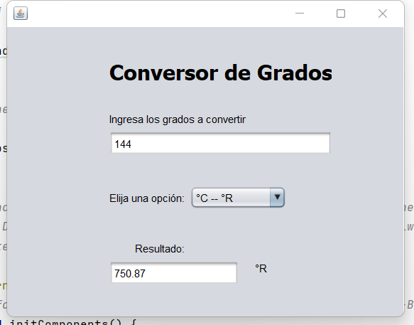

<h1 align="center">🥝 Java Temperature Conversor 🥝</h1>

  Temperature converting application, using jdk 16
  

> This project was made for learning purposes only.

>> Celcius, Fahrenheit, Kelvin and Rankine

# How to install
## Step 1⃣
* Import the project to intellij idea.
## Step 2⃣
* Compile and run.
## Step 🌳
* That's all, you must use java jdk 16.

# Download
Available for Windows.

[Check the latest release](https://github.com/alexa-00/grados/releases/latest/download)

# License
💜 [MIT License](/LICENSE)
